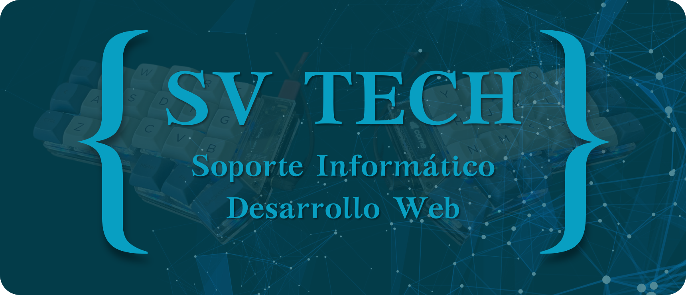

# 👋 Hola soy Mario Sandoval

  
  
  

 

## <picture></picture><b> Sobre mí</b>
Soy ingeniero Informático y desarrollador Fullstack con más de 4 años de experiencia.

Actualmente, trabajo en el sector Educativo, creando soluciones que optimizan procesos y tareas a través del desarrollo de sistemas web para la gestión de matrículas, control de retrasos y justificaciones, emisión de certificados y gestión de bases de datos.

Además, trabajo como freelance, donde he contribuido al desarrollo FrontEnd de sistemas de auditoría y a la creación de una landing page para un evento regional ([FEEM 2024](https://feem.cl)), cubriendo desde el diseño hasta el despliegue del sitio.

En 2023, fundé [svtech.cl](https://svtech.cl), una plataforma donde ofrezco servicios de soporte informático y desarrollo web, enfocados en optimización, eficiencia y seguridad de los datos.

  

## <picture></picture><b> Skills</b>

